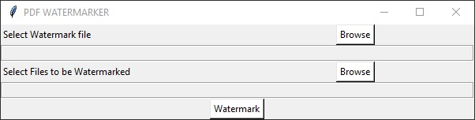

# pdfWaterMarker

Sample python PDF Watermarker built using the PyPDF2 library with tkinter GUI.

Requires the Watermark file to be created manually (example inside /watermark).

Outputs files based on their location and appends **_WM.pdf**

### Requires:
* pyPDF2
* tkinter

